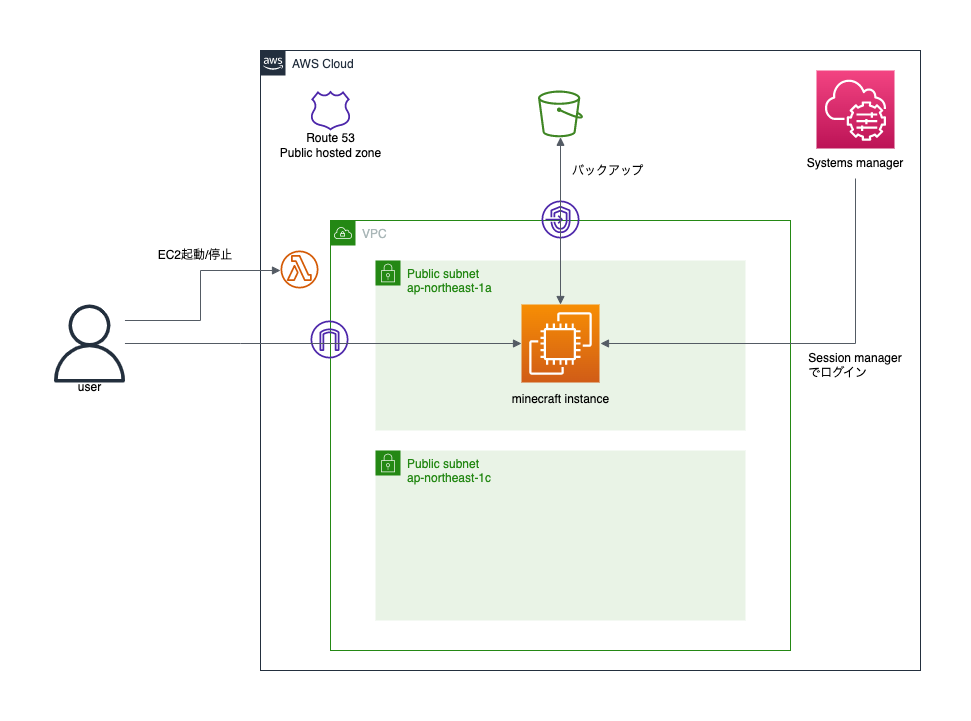

# aws-minecraft-infra

AWS上にマインクラフト環境作るTerraform

## 構成図



## deploy

### 事前に作成するリソース

* tfstate保存用のS3バケット
* EC2インスタンスのキーペア
* トークン格納用のParameter store
    * 値はquery stringで使えそうなものを適当に

### 手順

* `backend_config/sample.tf` をコピーし、作成したtfstate用のバケット名を指定する
* `tfvars.sample` を適当な名前でコピーし、値を設定する
* 下記コマンドでLambdaをビルドする

```sh
cd function_code
make
```

* 下記コマンドでデプロイ

```sh
terraform init -backend-config backend_config/<任意>.tf
terraform plan -var-file xxx.tfvars
terraform apply -var-file xxx.tfvars
```

## 検証・作業用インスタンス作成

Ubuntu Server 22.04 LTSの最新のAMIで検証用インスタンスを起動する  
tfstate分離のため一部の値はremote stateで参照する

### 手順

* `develop_instance/backend_config/sample.tf` をコピーし、検証用tfstateの値を設定する
* `develop_instance/tfvars.sample` をコピーし、値を設定する
* 下記コマンドでデプロイ

```sh
terraform init -backend-config backend_config/<任意>.tf
terraform plan -var-file xxx.tfvars
terraform apply -var-file xxx.tfvars

# AMIを変更する場合
terraform apply -var-file xxx.tfvars -var 'dev_ami_id=ami-xxxxxxxxxxxxxxxxx'
```
