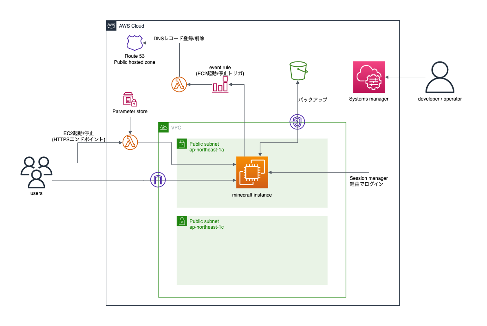

# aws-minecraft-infra

AWS上にマインクラフト環境作るTerraform

## 構成図



## deploy

### 事前に作成するリソース

* tfstate保存用のS3バケット
* EC2インスタンスのキーペア
* トークン格納用のParameter store
    * 値はquery stringで使えそうなものを適当に

### 手順

* `backend.tf.sample` をコピーし、作成したtfstate用のバケット名を指定する
* `tfvars.sample` を適当な名前でコピーし、値を設定する
* `funtion_code/*/` 配下のLambdaのコードをzipで固め、 `funtion_code/<ディレクトリ名>.zip` となるように配置
    * Makefile作成予定
* 下記コマンドでデプロイ

```sh
terraform init
terraform plan -var-file xxx.tfvars
terraform apply -var-file xxx.tfvars
```
